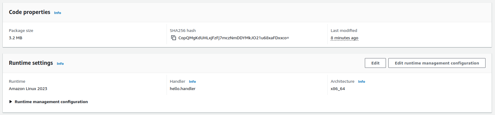
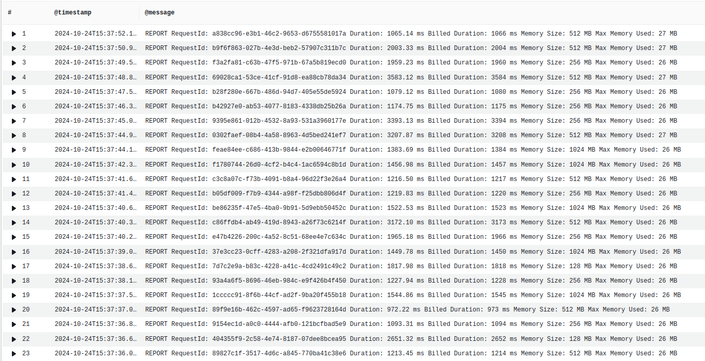
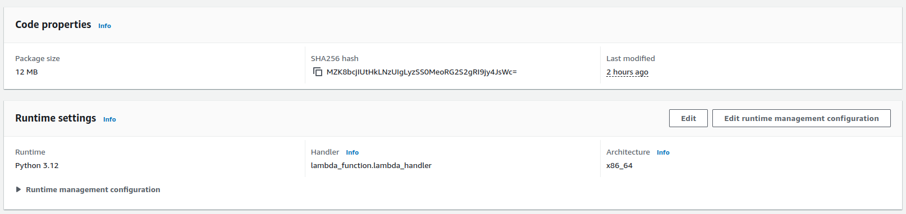
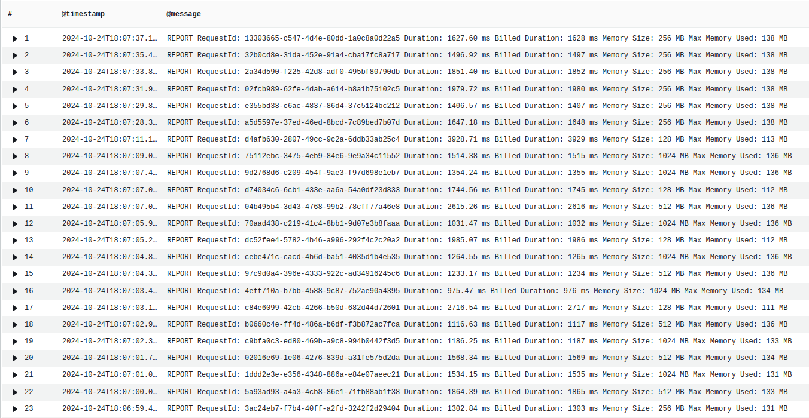
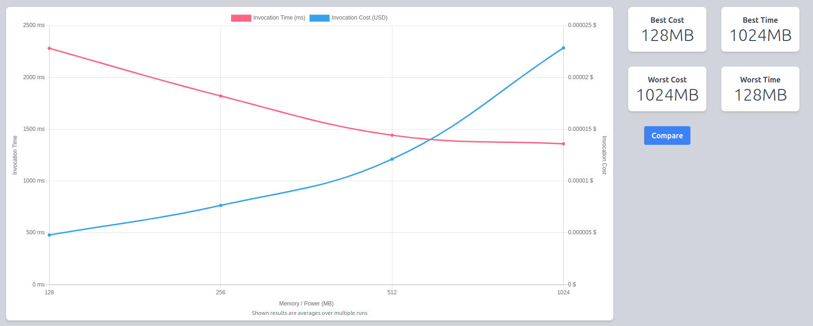
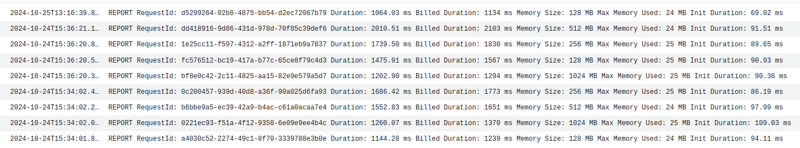
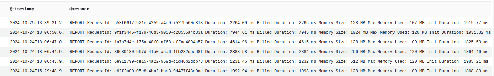

# **How to Deploy Your Rig App on AWS Lambda: A Step-by-Step Guide**

**TL;DR**

## **Introduction**

Welcome to the series **Deploy Your Rig Application**!  
Now that you've built a rig app, you may now be wondering what’s the best way to deploy the it for your users to enjoy. If so, you’ve come to the right place!   
This series will walk you through different ways to deploy the application using various services. In this tutorial we will be covering serverless deployment on AWS lambda, but stay tuned for deployment via AWS Fargate, AWS Amplify, ShuttleRS, and more! Depending on your use case, you’ll be able to choose the most fitting deployment option. Let’s go\!

## **Prerequisites**

Before we begin building, ensure you have the following:

* A functioning rig application. We will be using this [github repo](https://github.com/garance-buricatu/rig-aws-lambda) in our examples.   
* An AWS account  
* An Open AI api key

## **Let's get started**

### AWS Lambda use cases
You may want to deploy your Rust application on AWS lambda if it’s a task that can execute in under 15 mins or if your app is a REST API backend.

### AWS 🤝 Rust

AWS Lambda supports Rust through the use of the [OS-only runtime Amazon Linux 2023](https://docs.aws.amazon.com/lambda/latest/dg/lambda-runtimes.html) (a lambda runtime) in conjunction with the [Rust runtime client](https://github.com/awslabs/aws-lambda-rust-runtime), a rust crate. 

#### REST API backend
* Use the [`lambda-http`](https://github.com/awslabs/aws-lambda-rust-runtime/tree/main/lambda-http) crate (from the runtime client) to write your function’s entrypoint. 
* Then, route traffic to your lambda via AWS API services like [Api Gateway](https://aws.amazon.com/api-gateway/), [App Sync](https://aws.amazon.com/pm/appsync), [VPC lattice](https://aws.amazon.com/vpc/lattice/), etc ... 
* If your lambda handles multple endpoints of your API, the crate [axum](https://github.com/tokio-rs/axum) faciliates the routing within the lambda.

#### Event based task
* Ex: your lambda is triggered by S3 to process an object that was just added to your bucket.
* Use the [`lambda_runtime`](https://github.com/awslabs/aws-lambda-rust-runtime/tree/main/lambda-runtime) crate with [`lambda_events`](https://github.com/awslabs/aws-lambda-rust-runtime/tree/main/lambda-events) (from the runtime client) to write your function’s entrypoint.
* Then, invoke your function either via [`lambda invoke` command](https://docs.aws.amazon.com/cli/latest/reference/lambda/invoke.html) or with integrated AWS triggers (ie. S3 UploadObject trigger). 

**Note**: for both cases, the crate `tokio` must also be added to your project as the lambda runtime client uses `tokio` to handle asynchronous calls.

### Our example: A basic OpenAI agent

The mini app in crate [`rig-entertainer-rust`](https://github.com/garance-buricatu/rig-aws-lambda/tree/master/rig-entertainer-rust) is a Rust program that is executed via the  `lambda_runtime`. It invokes an OpenAI agent, designed by `rig`, to entertain users with jokes. It is an event-based task that I will execute with the `lambda invoke` command.

#### My application is written, let’s deploy it to the cloud\!

There are *many* ways to deploy Rust lambdas to AWS. Some out of the box options include the AWS CLI, the [cargo lambda](https://www.cargo-lambda.info/guide/getting-started.html) CLI, the AWS SAM CLI, the AWS CDK, and more. You can also decide to create a Dockerfile for your app and use that container image in your Lambda function instead. See some useful examples [here](https://docs.aws.amazon.com/lambda/latest/dg/rust-package.html).

I used the cargo lambda CLI option to deploy the code in `rig-entertainer-rust` from my local machine to an AWS lambda:

```bash
// 1 - Added my AWS credentials to my terminal
// 2 - Created an AWS Lambda function named ‘rig-entertainer-rust’ with architecture x86_64.

cd rig-entertainer-lambda
cargo lambda build --release <--arm64>
cargo lambda deploy rig-entertainer-rust --binary-name rig_entertainer
``` 

#### Let’s talk about some AWS Lambda metrics when using Rust

This is the code configuration of the `rig-entertainer-rust` function in AWS. The function’s code package (bundled code and dependencies required for lambda to run) includes the single rust binary called `bootstrap`, which is 3.2 MB.



Below is a screenshot of average execution time comparisons when the lambda is invoked 50 times for each memory configuration of set to 128, 256, 512, 1024. The best configuration is 128 MB for an average runtime of 1390ms.


However, note that the average memory usage of the rust function is 26MB per execution.


### How does it compare with python LLM tools like Langchain?
I replicated the OpenAI entertainer agent using the [langchain](https://python.langchain.com/docs/introduction/) python library in this [mini python app](https://github.com/garance-buricatu/rig-aws-lambda/tree/master/langchain-entertainer-python) which I also deployed as an AWS Lambda.

This is the code configuration of the `langchain-entertainer-python` function in AWS. The function’s code package is a zip file including the lambda function code and all dependencies required for the lambda program to run.






### Cold starts
[Cold starts](https://docs.aws.amazon.com/lambda/latest/operatorguide/execution-environments.html) occur when the lambda function's execution environment needs to be booted up from scratch. This includes settinging the actual compute that the lambda function is running on, and downloading the lambda function code and dependencies in that environment.    
Cold start latency doesn't affect all function executions because once the lambda environment has been setup, it will be reused by subsequent executions of the same lambda.   

In Cloudwatch logs, if a function execution requires a cold start, we see the `Init Duration` metric at the end of the execution. 

For `rig-entertainer-rust`, we can see that the average cold start time is 90.9ms:


For `langchain-entertainer-py`, the average cold start time is: 1,898.52ms, ie. 20x as much as the rig coldstart.
