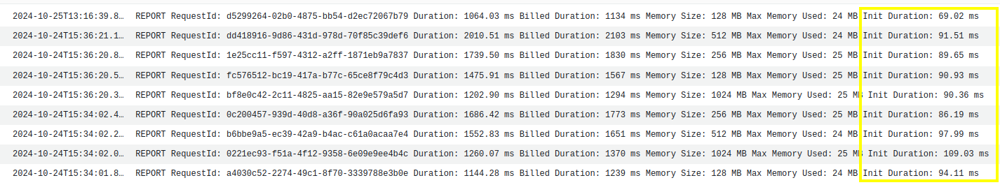

# How to Deploy Your Rig App on AWS Lambda: A Step-by-Step Guide

**TL;DR**
- **Rig**: Rust library simplifying LLM app development
- **Developer-Friendly**: Intuitive API design, comprehensive documentation, and scalability from simple chatbots to complex AI systems.
- **Key Features**: Unified API across LLM providers (OpenAI, Cohere); Streamlined embeddings and vector store support; High-level abstractions for complex AI workflows (e.g., RAG); Leverages Rust's performance and safety; Extensible for custom implementations
- **Contribute**: Build with Rig, provide feedback, win $100
- **Resources**: [GitHub](https://github.com/0xPlaygrounds/rig), [Examples](https://github.com/0xPlaygrounds/awesome-rig), [Docs](https://docs.rs/rig-core/latest/rig/).

## Introduction

Welcome to the series **Deploy Your Rig Application**!
Apps built with Rig can vary in complexity across three core dimensions: LLM usage, vector storage, and the compute infrastructure where the application is deployed. In this series, we’ll explore how different combinations of these dimensions can be configured for production use.   

Today, we’ll start with a simple Rig agent that uses the [OpenAI model GPT-4-turbo](https://platform.openai.com/docs/models/gpt-4o), does not rely on vector storage, and will be deployed on AWS Lambda.   

Let’s dive in!

## Prerequisites

Before we begin building, ensure you have the following:

* A clone of the [`rig-entertainer-lambda`](https://github.com/garance-buricatu/rig-aws/tree/master/rig-entertainer-lambda) crate (or your own Rig application).   
* An AWS account  
* An Open AI api key


## AWS Lambda Quick Overview
You might deploy your Rust application on AWS lambda if it’s a task that can execute in under 15 mins or if your app is a REST API backend.

### AWS 🤝 Rust

AWS Lambda supports Rust through the use of the [OS-only runtime Amazon Linux 2023](https://docs.aws.amazon.com/lambda/latest/dg/lambda-runtimes.html) (a lambda runtime) in conjunction with the [Rust runtime client](https://github.com/awslabs/aws-lambda-rust-runtime), a rust crate. 

#### REST API backend
* Use the [`lambda-http`](https://github.com/awslabs/aws-lambda-rust-runtime/tree/main/lambda-http) crate (from the runtime client) to write your function’s entrypoint. 
* Then, route traffic to your lambda via AWS API services like [Api Gateway](https://aws.amazon.com/api-gateway/), [App Sync](https://aws.amazon.com/pm/appsync), [VPC lattice](https://aws.amazon.com/vpc/lattice/), etc ... 
* If your lambda handles multple endpoints of your API, the crate [axum](https://github.com/tokio-rs/axum) faciliates the routing within the lambda.

#### Event based task
* Ex: your lambda is triggered by S3 to process an object that was just added to your bucket.
* Use the [`lambda_runtime`](https://github.com/awslabs/aws-lambda-rust-runtime/tree/main/lambda-runtime) crate with [`lambda_events`](https://github.com/awslabs/aws-lambda-rust-runtime/tree/main/lambda-events) (from the runtime client) to write your function’s entrypoint.
* Then, invoke your function either via [`lambda invoke` command](https://docs.aws.amazon.com/cli/latest/reference/lambda/invoke.html) or with integrated AWS triggers (ie. S3 UploadObject trigger). 

**Note**: for both cases, the crate `tokio` must also be added to your project as the lambda runtime client uses `tokio` to handle asynchronous calls.

## Rig Entertainer Agent Overview

The mini app in crate [`rig-entertainer-lambda`](https://github.com/garance-buricatu/rig-aws-lambda/tree/master/rig-entertainer-lambda) is a Rust program that is executed via the `lambda_runtime`. It invokes an OpenAI agent, designed by `rig`, to entertain users with jokes. It is an event-based task that I will execute with the `lambda invoke` command.

The main takeaway here is that the app's `Cargo.toml` file must include the following dependencies:   
1. `rig-core`
2. `lambda_runtime`
3. `tokio`

## Now let's deploy it!

There are *many* ways to deploy Rust lambdas to AWS. Some out of the box options include the AWS CLI, the [cargo lambda](https://www.cargo-lambda.info/guide/getting-started.html) CLI, the AWS SAM CLI, the AWS CDK, and more. You can also decide to create a Dockerfile for your app and use that container image in your Lambda function instead. See some useful examples [here](https://docs.aws.amazon.com/lambda/latest/dg/rust-package.html).

I used the cargo lambda CLI option to deploy the code in `rig-entertainer-rust` from my local machine to an AWS lambda:

```bash
// Add your AWS credentials to my terminal
// Create an AWS Lambda function named ‘rig-entertainer’ with architecture x86_64.

function_name='rig-entertainer'

cd rig-entertainer-lambda
cargo lambda build --release // Can define different architectures here with --arm64 for example
cargo lambda deploy $function_name // Since the name of the crate is the same as the the lambda function name, no need to specify a binary file
``` 

### Rust lambda metrics on the cloud

This is the code configuration of the `rig-entertainer` function in AWS. The function’s code package (bundled code and dependencies required for lambda to run) includes the single rust binary called `bootstrap`, which is 3.2 MB.


The average memory usage (shown in yellow) of the rust function is 26MB per execution. You can also see in red the amount of memory that the lambda function was configured with.


Below is a screenshot of average execution time comparisons when the lambda is invoked 50 times for each memory configuration of 128MB, 256MB, 512MB, 1024MB. We know that the function uses on average only 26MB per execution which is way less than the minimum memory configuration of 128MB. It is still interesting to test th function at different memory settings since the lambda CPU configuration is set in proportion to the memory so it could still affect the performance.

We can see that adding memory to the function (and therefore adding CPUs) does not affect the function performance at all.


### How does it compare with python LLM tools like Langchain?
I replicated the OpenAI entertainer agent using the [langchain](https://python.langchain.com/docs/introduction/) python library in this [mini python app](https://github.com/garance-buricatu/rig-aws-lambda/tree/master/langchain-entertainer-python) which I also deployed as an AWS Lambda.

This is the code configuration of the `langchain-entertainer-python` function in AWS. The function’s code package is a zip file including the lambda function code and all dependencies required for the lambda program to run.


Adding memory and CPU power to the function increases its efficiency.


### Cold starts
[Cold starts](https://docs.aws.amazon.com/lambda/latest/operatorguide/execution-environments.html) occur when the lambda function's execution environment needs to be booted up from scratch. This includes settinging the actual compute that the lambda function is running on, and downloading the lambda function code and dependencies in that environment.    
Cold start latency doesn't affect all function executions because once the lambda environment has been setup, it will be reused by subsequent executions of the same lambda.   

In Cloudwatch logs, if a function execution requires a cold start, we see the `Init Duration` metric at the end of the execution. 

For `rig-entertainer-rust`, we can see that the average cold start time is 90.9ms:


For `langchain-entertainer-py`, the average cold start time is: 1,898.52ms, ie. 20x as much as the rig coldstart.
