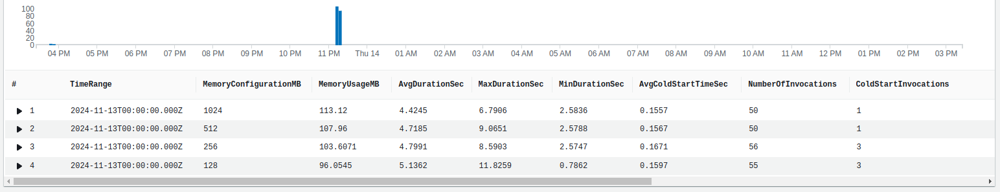
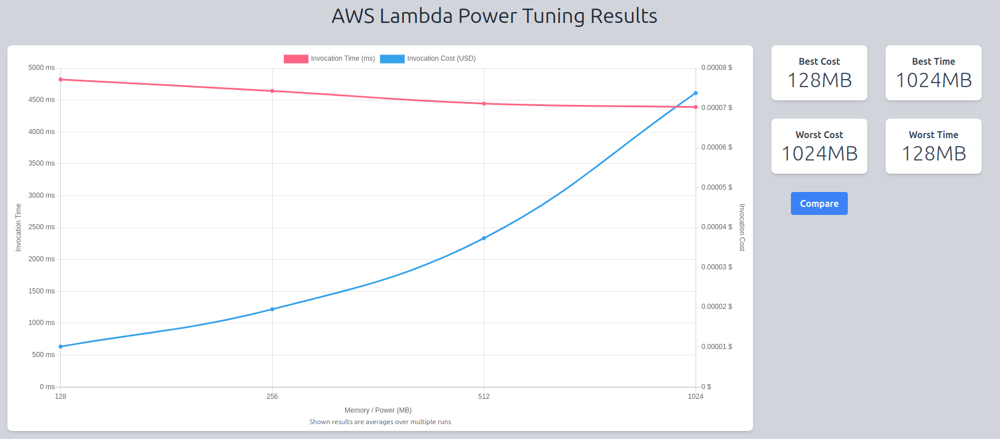
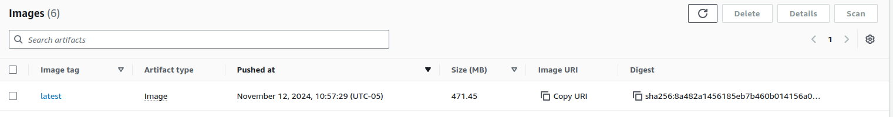
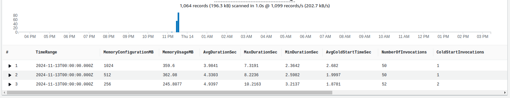
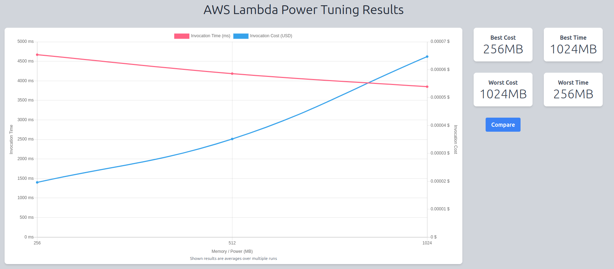

# How to Deploy Your Rig App with LanceDB: A Step-by-Step Guide

## TL;DR
* A step-by-step walkthrough on deploying your [Rig](https://github.com/0xPlaygrounds/rig) app with [LanceDB](https://lancedb.com) on AWS Lambda. You'll learn how to prepare your app, choose the right storage backend (like S3 or EFS), and optimize performance through efficient use of cloud metrics. 
* **Stats: Rig Agent on AWS Lmabda :**
    1. Low memory usage (96MB - 113MB)
    2. Fast cold starts (consistently 160ms)
* **Stats: LangChain Agent on AWS Lmabda:**
    1. Higher memory usage (246MB - 360MB)
    2. Slower cold starts (1,900ms - 2,700ms)

## Table of Contents
- [How to Deploy Your Rig App with LanceDB: A Step-by-Step Guide](#how-to-deploy-your-rig-app-with-lancedb-a-step-by-step-guide)
    - [Introduction](#introduction)
    - [Prerequisites](#prerequisites)
    - [Our use case: Montreal 🌇](#our-use-case)
    - [LanceDB Quick Overview 💾](#lancedb-quick-overview)
    - [LanceDB Storage Backends](#lancedb-storage-backends)
        - [S3 - Object Store](#s3---object-store)
        - [Lambda ephemeral storage - Local file system](#lambda-ephemeral-storage---local-file-system)
        - [EFS - Virtual file system](#efs---virtual-file-system)
    - [Metrics on the cloud ☁️](#metrics-on-the-cloud-)
        - [Memory, CPU, and runtime](#memory-cpu-and-runtime)
    - [Langchain Montreal Agent App 🐍](#langchain-montreal-agent-app-)
        - [Deployment package](#deployment-package-1)
        - [Memory, CPU, and runtime](#memory-cpu-and-runtime-1)
    - [Resources](#resources)
    - [The Road Ahead: Rig's Future](#the-road-ahead-rigs-future)
    - [Conclusion and Call to Action](#conclusion-and-call-to-action)


## Introduction

Welcome back to **Deploy Your Rig Application**! Apps built with Rig vary in complexity based on LLM usage, knowledge bases for RAG, and infrastructure deployment. This series explores various configurations for production use.

⭐ **Today's Highlight**: Rig's **LanceDB integration**! ⭐

We'll deploy a Rig agent using OpenAI's `text-embedding-ada-002` and `GPT-4o`, relying on the [LanceDB vector store](https://lancedb.com) and deployed on [AWS Lambda](https://aws.amazon.com/lambda/).

> *💡 If you're new to Rig and want to start from the beginning or are looking for additional tutorials, check out our [blog series](https://rig.rs/build-with-rig-guide.html).*

Let’s dive in!

## Prerequisites

Before we begin building, ensure you have the following:

* A clone of the [`rig-montreal-lancedb`](https://github.com/garance-buricatu/rig-aws/tree/master/rig-montreal-lancedb) crate  which includes two separate binaries: a [loader](https://github.com/garance-buricatu/rig-aws/blob/master/rig-montreal-lancedb/src/bin/loader.rs) (writes data to LanceDB) and an [app](https://github.com/garance-buricatu/rig-aws/blob/master/rig-montreal-lancedb/src/bin/app.rs) (reads from LanceDB).  
* An AWS account  
* A OpenAI api key

## Our use case: Montreal 🌇
The app in [`rig-montreal-lancedb`](https://github.com/garance-buricatu/rig-aws/tree/master/rig-montreal-lancedb) RAGs data from [montreal open data](https://donnees.montreal.ca). The `loader` binary indexes all dataset metadata (name, description, tags, ...) into LanceDB and the `app` binary performs vector search on the data based on a prompt. 
> **Prompt:** Give me information on gaseous pollutants in Montreal. How are the concentrations measured?
**App answer:** The concentrations of gaseous pollutants in Montreal are measured through the Réseau de surveillance de la qualité de l'air (RSQA), which is a network of measurement stations located on the Island of Montreal. These stations continuously determine the atmospheric concentration of various pollutants. The data is transmitted via telemetry, ...

## LanceDB Quick Overview 💾
[**Lance**](https://github.com/lancedb/lance) is an **open-source columnar data format** designed for performant ML workloads.
* Written in Rust 🦀.
* Native support for storing, querying and filtering vectors, deeply nested data and multi-modal data (text, images, videos, point clouds, and more).
* Support for vector similarity search, full-text search and SQL.   
* Interoperable with other columnar formats (such as Parquet) via [Arrow](https://arrow.apache.org/overview/)
* Disk-based indexes and storage.
* Built to scale to hundreds of terabytes of data.


[**LanceDB**](https://lancedb.github.io/lancedb/) is an **open-source vector database**.    
* Written in Rust 🦀.
* Built on top of Lance.
* Support for Python, JavaScript, and Rust client libraries to interact with the database.
* Allows storage of raw data, metadata, and embeddings all at once.

## LanceDB Storage Options
LanceDB's underlying optimized storage format, `lance`, is flexible enough to be supported by various storage backends, such as  local NVMe, [EBS](https://aws.amazon.com/ebs/), [EFS](https://aws.amazon.com/efs/), [S3](https://aws.amazon.com/s3/) and other third-party APIs that connect to the cloud. 

> 💡 All you need to do to use a specific storage backend is define its connection string in the LanceDB client!

Let's go through some storage options that are compatible with AWS Lambda!

## S3 - Object Store
> ❕Data is stored as individual objects *all at the same level*.
  ❕Objects are kept track of by a distributed hash table (DHT), where each object is identified by a unique ID.

| **Pros of Object Stores**                         | **Cons of Object Stores**                     |
|---------------------------------------------------|-----------------------------------------------|
| **Unlimited scaling** ♾️: Objects can be stored across distributed systems, eliminating single-node limitations. This is ideal for ML and AI applications handling large data volumes. | **Higher latency** 🚚: Accessing a remote object store over a network via HTTP/HTTPS adds overhead compared to file system protocols like NFS. Additionally, storing metadata separately from objects introduces some retrieval latency. |
| **Cheap** 💸: The simple storage design makes it more affordable than traditional file systems. | |
| **Highly available** and **resilient** 💪: Affordable storage allows for redundant data storage within and across data centers. | |

### S3 + LanceDB setup on AWS lambda
**⚠️ Important**: S3 does **not support concurrent writes**. If multiple processes attempt to write to the same table simultaneously, it could lead to data corruption. But there's a solution! Use the [DynamoDB commit store feature in LanceDB](https://lancedb.github.io/lancedb/guides/storage/#aws-iam-permissions) to prevent this.

---

#### Part I - Write lambda function code
In the lambda code, connect to the store via the [LanceBD client](https://docs.rs/lancedb/latest/lancedb/connection/struct.Connection.html) as so:
```rust
// Note: Create s3://rig-montreal-lancedb bucket beforehand
let db = lancedb::connect("s3://rig-montreal-lancedb").execute().await?;
// OR
let db = lancedb::connect("s3+ddb://rig-montreal-lancedb?ddbTableName=my-dynamodb-table").execute().await?;
```

#### Part II - Deploy lambdas
> 💡 Need a refresher on Lambda deployments? Check out our [previous blog](https://dev.to/garance_buricatu_a6864136/how-to-deploy-your-rig-app-on-aws-lambda-a-step-by-step-guide-2ge5) for a full walkthrough.

```bash
# Lambda that writes to the store
cargo lambda build --release --bin loader
cargo lambda deploy --binary-name loader rig-montreal-lancedb-loader

# Lambda that reads to the store
cargo lambda build --release --bin app
cargo lambda deploy --binary-name app rig-montreal-lancedb-app
```

> 💡 Don’t forget to set the necessary [IAM permissions](https://lancedb.github.io/lancedb/guides/storage/#aws-iam-permissions)! Your lambda functions need appropriate access to the S3 bucket — whether it’s read, write, or both.

## Lambda ephemeral storage - Local file system
[Lambda ephemeral storage](https://docs.aws.amazon.com/lambda/latest/dg/configuration-ephemeral-storage.html) is **temporary and unique** to each execution environment, it is not intended for persistent storage. In other words, any LanceDB store created during the lambda execution on ephemeral storage will be wiped when the function terminates.
This option can be used for very specific use cases where writing to the store needs to be done in the same process as reading, and data is only read by a single lambda execution.

Ephemeral storage in a lambda is found in the `/tmp` directory. All you need to do is: 
```rust
let db = lancedb::connect("/tmp").execute().await?;
```

## EFS - Virtual file system
> ❕A **serverless**, **elastic**, **shared file system** designed to be consumed by AWS services like EC2 and Lambda.
  ❕Data is **persisted** and can be shared across lambda invocations (unlike the S3 without commit store and ephemeral storage options above).
  ❕Supports up to 25,000 **concurrent connections**.

| **Pros of EFS**                                                                                                                                   | **Cons of EFS**                                      |
|:---------------------------------------------------------------------------------------------------------------------------------------------------|:-----------------------------------------------------|
| **Stateful lambda**: Mounting an EFS instance on a lambda function provides knowledge of previous and concurrent executions.                      | **Development time**: More involved cloud setup      |
| **Low latency** ⚡: A lambda function resides in the same **VPC** as the EFS instance, allowing low-latency network calls via the **NFS** protocol. | **Cost** 💲: More expensive than S3                  |


### EFS + LanceDB setup on AWS Lambda
> 💡 Setting up EFS in the cloud can be intricate, so you can use our [CloudFormation template](https://github.com/garance-buricatu/rig-aws/blob/master/rig-montreal-lancedb/template.yaml) to streamline the deployment process.

#### Part I - Build Rust code and upload zip files to S3
In the lambda code, connect to the store via the [LanceBD client](https://docs.rs/lancedb/latest/lancedb/connection/struct.Connection.html) as so:
```rust
let db = lancedb::connect("/mnt/efs").execute().await?;
```

Then, compile your code, zip the binaries, and upload them to S3:
```bash
# Can also do this directly on the AWS console
aws s3api create-bucket --bucket rig-montreal-efs-lancedb

cargo lambda build --release --bin loader
cargo lambda build --release --bin app

cd target/lambda/loader
zip -r bootstrap.zip bootstrap
# Can also do this directly on the AWS console
aws s3 cp bootstrap.zip s3://montreal-lancedb/rig/loader/

cd ..
zip -r bootstrap.zip bootstrap
# Can also do this directly on the AWS console
aws s3 cp bootstrap.zip s3://montreal-lancedb/rig/app/

```

#### Part II - Understand Cloudformation template
The [template](https://github.com/garance-buricatu/rig-aws/blob/master/rig-montreal-lancedb/template.yaml) assumes that your AWS account already has the following resources:
1. A **VPC** with at least two private subnets in separate availability zones, each with public internet access.
3. An **S3 bucket** (as created in Part I) for storing Lambda code.
> 💡 If you’re missing these resources, follow this AWS [tutorial](https://docs.aws.amazon.com/vpc/latest/userguide/vpc-example-private-subnets-nat.html) to set up a basic VPC and subnets.

**EFS setup**
1. **Mount Targets:** Create two mount targets for your EFS instance — one in each subnet (specified in `Parameters` section of CFT template).
2. **Security Groups:** Set up an EFS security group with rules to allow **NFS traffic** from your Lambda functions’ security group.

**Lambda functions setup**
1. **Loader and App Lambdas:** Deploy both Lambda functions (`loader` and `app`) in the same subnets as your EFS mount targets.
2. **Security Groups:** Assign a security group that enables access to the EFS security group and public internet.
3. **EFS Mounting:** Configure the Lambdas to mount the EFS targets at `/mnt/efs`.

> 💡 Once everything’s ready, deploy the CloudFormation template to launch your environment with just one click!

### Metrics on the cloud ☁️
We  replicated the Montreal agent using [langchain 🐍](https://python.langchain.com/) in this [python project](https://github.com/garance-buricatu/rig-aws/tree/master/langchain-montreal-lancedb) which contains the source code for the [loader](https://github.com/garance-buricatu/rig-aws/blob/master/langchain-montreal-lancedb/loader.py) and [app](https://github.com/garance-buricatu/rig-aws/blob/master/langchain-montreal-lancedb/app.py) lambdas.

Let's look at some metrics of the Rig app and the LangChain app on the cloud and compare them!

### Rig - Memory, runtime, and coldstarts
We invoked the `app` function 50 times for each memory configuration of 128MB, 256MB, 512MB, 1024MB using the [power tuner tool](https://github.com/alexcasalboni/aws-lambda-power-tuning).
The Cloudwatch query below gathers averages about runtime, memory usage, and cold starts of the lambda over 50 invocations. 
```
filter @type = "REPORT"
| stats 
      avg(@maxMemoryUsed) / 1000000 as MemoryUsageMB,
      avg(@duration) / 1000 as AvgDurationSec,
      max(@duration) / 1000 as MaxDurationSec, 
      min(@duration) / 1000 as MinDurationSec, 
      avg(@initDuration) / 1000 as AvgColdStartTimeSec, 
      count(*) as NumberOfInvocations,
      sum(@initDuration > 0) as ColdStartInvocations
by bin(1d) as TimeRange, @memorySize / 1000000 as MemoryConfigurationMB
```


At the memory configuration of **128MB**, the lambda has the lowest average memory usage of **96.1 MB** and the highest runtime of **5.1s**. At a memory configuration of **1GB**, the lambda has the highest average memory usage of **113.1 MB** and the lowest runtime of **4.4s**. In other words, with an extra ~7MB of memory usage, the lambda function was 700ms faster.

In terms of **cold starts** ❄️, the average initialization time remains steady around **0.16s**. 

The chart below shows the same data as above in a different way: the four different memory configurations are on the x-axis and the average runtime (RED) and cost (BLUE) are shown on the y-axis.


We see that adding memory to the function (and therefore adding computational power) does in fact affect the performance of the lambda by less than a second.

### Langchain - Memory, runtime, and coldstarts

#### Deployment package
We are not able to use zip files for the deployment package of the lambda functions as the zip size exceeds the maximum size allowed by AWS. The [loader dependencies](https://github.com/garance-buricatu/rig-aws/blob/master/langchain-montreal-lancedb/loader_requirements.txt) and [app dependencies](https://github.com/garance-buricatu/rig-aws/blob/master/langchain-montreal-lancedb/app_requirements.txt) create zip files of size around 150 MB.

Instead, we must use container images. The [docker image](https://github.com/garance-buricatu/rig-aws/blob/master/langchain-montreal-lancedb/Dockerfile) has size 471.45MB using the base python lambda image.


We did the same experiment as with the Rig app above and got the following metrics:


First of all, the function is unable to run with a memory allocation of 128MB. It gets killed at this allocation size dur to lack of memory. So we will compare the three following memory configurations: 256MB, 512MB, 1GB. 

At the memory configuration of **256MB**, the lambda has the lowest average memory usage of **245.8 MB** and the highest runtime of **4.9s**. At a memory configuration of **1GB**, the lambda has the highest average memory usage of **359.6 MB** and the lowest runtime of **4.0s**. In other words, with an extra **~113MB** of memory usage, the lambda function was 1s faster.

In terms of **cold starts** ❄️, the average initialization time increases as the memory configuration increases with the lowest being **1.9s** and the highest being **2.7s**. 



We see that adding memory to the function (and therefore adding computational power) also affects the performance of the lambda by about a second.

## Resources

Rig is an emerging project in the open-source community, and we're continuously expanding its ecosystem with new integrations and tools. We believe in the power of community-driven development and welcome contributions from developers of all skill levels.

Stay connected and contribute to Rig's growth:

- 📚 [Documentation](https://docs.rs/rig-core/latest/rig/): Comprehensive guides and API references
- 💻 [GitHub Repository](https://github.com/0xPlaygrounds/rig): Contribute, report issues, or star the project
- 🌐 [Official Website](https://rig.rs/): Latest news, tutorials, and resources

Join our [community](https://discord.com/invite/playgrounds) channel to discuss ideas, seek help, and collaborate with other Rig developers.

## The Road Ahead: Rig's Future

As we continue to develop Rig, we're excited about the possibilities. Our roadmap includes:

1. **Expanding LLM Provider Support**: Adding integrations for more LLM providers to give developers even more choices.
2. **Enhanced Performance Optimizations**: Continuously improving Rig's performance to handle larger-scale applications.
3. **Advanced AI Workflow Templates**: Providing pre-built templates for common AI workflows to accelerate development further.
4. **Ecosystem Growth**: Developing additional tools and libraries that complement Rig's core functionality.

We're committed to making Rig the go-to library for LLM application development in Rust, and your feedback is crucial in shaping this journey.

## Conclusion and Call to Action

Rig is transforming LLM-powered application development in Rust by providing:
- A unified, intuitive API for multiple LLM providers
- High-level abstractions for complex AI workflows
- Type-safe development leveraging Rust's powerful features
- Extensibility and seamless ecosystem integration

We believe Rig has the potential to significantly enhance developers' building of AI applications, and we want you to be part of this journey.

**Your Feedback Matters!** We're offering a unique opportunity to shape the future of Rig:

1. Build an AI-powered application using Rig.
2. Share your experience and insights via this [feedback form](https://bit.ly/Rig-Review).
3. Get a chance to win $100 and have your project featured in our showcase!

Your insights will directly influence Rig's development, helping us create a tool that truly meets the needs of AI developers. 🦀✨

Thanks for reading,  
[Garance](https://github.com/garance-buricatu)   
Full-stack developer @ [Playgrounds Analytics](https://playgrounds.network/)