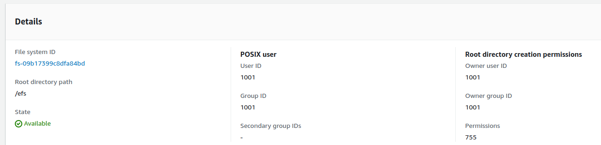

# Deploying Rig on Lambda with LanceDB vector store
LanceDB is a vector database built from the ground-up to be efficient on disk. It supports multiple storage backends, including local NVMe, EBS, EFS and other third-party APIs that connect to the cloud. We will walk though three different storage options for your Rig app deployed on AWS Lambda that uses LanceDB as a vector store.

## Local - Ephemeral storage
https://docs.aws.amazon.com/lambda/latest/dg/configuration-ephemeral-storage.html

Lambda ephemeral storage is temporary and unique to each execution environment, it is not intended for durable storage. In other words, any LanceDB store created during the lambda execution will be wiped when the function terminates. If can be set between 512 MB and 10240 MB.

Some uses cases may include:
* dynamic data loading with one-off RAG operation.

(see 2024-10-29T15:16:11.877-04:00 logs)

Initialize the DB in the /tmp folder of the lambda and configure the ephemeral storage property.
```
let db = lancedb::connect("/tmp").execute().await?;
```

Performance - lowest latency
Cost - highest cost

## Local - EFS
https://aws.amazon.com/blogs/compute/using-amazon-efs-for-aws-lambda-in-your-serverless-applications/

EFS is a serverless, elastic, shared file system designed to be consumed by other AWS services. Data in EFS is persisted and can be shared across lambda invocations (unlike the ephemeral storage option above). It supports up to 25,000 concurrent connections.

Since the data in the file system can be shared, we will have a single lambda **writing** data to the EFS file system and many lambdas **reading** from the EFS file system.

### Setup EFS with AWS Lambda
Follow these steps to setup your file system with your lambda function:   
1. Create EFS file system.
* **Performance  mode**: I chose **general purpose** for my app
* **Throughput mode**: I chose **elastic** for my app 
* **Networking**: Chose the **VPC** that the file system will live in, and the **subnets** that it will be mounted on. I chose two **private subnets** in different availability zones. **Note**: we will come back here later to set up a **security group** for each mount target.
* **Access points**: Create a single access point with the following config:


2. Create lambda function that **writes** to EFS.
* See code

3. Create lambda function that **reads** from EFS.


### Cold starts
When a lambda' function execution environment is prepared for the first time, the file system is mounted. When the execution environment is warm from previous invocations, the EFS mount is already available.

### Performance
### Cost

## S3
Performance - highest latency
Cost - lowest cost